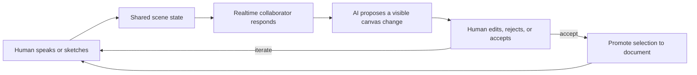
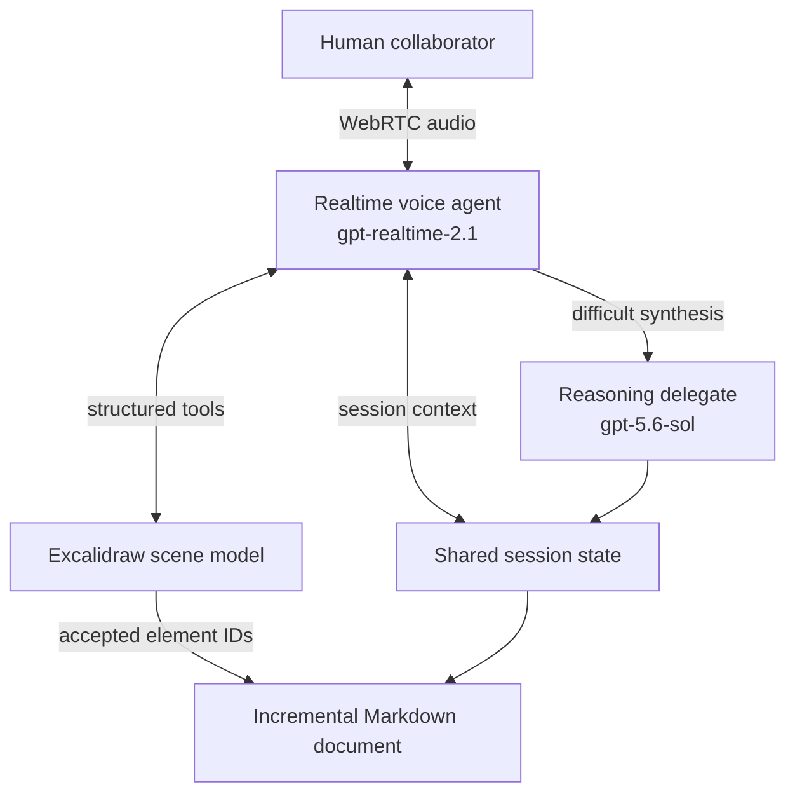

# CoThinker — POC design

## Problem

Current AI tools ask people to adapt natural design work to a chat box. Complex ideas are easier to express when people can talk, sketch, point, rearrange, and revise in the same shared space. Existing collaborative whiteboards provide the space, but interacting with them through generic browser automation is slow and fragile.

CoThinker tests the inverse: bring the AI into the human workflow. The AI should feel like a collaborator at the same whiteboard—not a diagram generator operating after the conversation.

## Differentiating hypothesis

An interruptible voice conversation combined with a shared, editable, spatial working memory will reduce the friction of expressing and refining complex ideas compared with chat alone.

The differentiator is not voice, canvas, or document generation in isolation. It is the tight, reversible loop among all three:

1. Human and AI discuss while the canvas stays active.
2. Either collaborator changes the same spatial artifact.
3. Both inspect, correct, move, reject, or extend the proposal.
4. Only accepted work is promoted into durable documentation.
5. The next cycle begins without regenerating the whole canvas or document.

## Exact first scenario

Design a software architecture through realtime conversation and a shared whiteboard, then progressively convert accepted decisions into a traceable design document.

The product is intentionally domain-general. The same interaction should later work for a greenhouse experiment, espresso-machine explanation, robotics layout, UX journey, or other design problem.

## Minimum user journey

The smallest convincing loop is: one spoken or typed intent → one visible AI proposal → one human correction or acceptance → one document section with source IDs.

## Architecture decision

Three orchestration shapes were considered:

1. **Single realtime agent** — one model owns conversation, reasoning, and canvas tools. Lowest initial complexity, but difficult reasoning can make the live interaction feel slow.
2. **Realtime voice agent with a reasoning delegate** — the voice agent owns the continuous, interruptible conversation and light canvas actions; it delegates only difficult synthesis to a deeper model. **Selected for this POC.**
3. **Coordinator with multiple specialist agents** — a coordinator routes among voice, vision, canvas, reasoning, and documentation specialists. Potentially powerful, but premature before the core interaction is validated.

Option 2 preserves the prerequisite the user clarified: realtime conversation is always handled by the voice agent. Delegation must not pause the conversational loop.

This is based on the public OpenAI Realtime and voice-agent orchestration capabilities, not an assertion about the private implementation of the OpenAI iOS app. Public documentation supports a low-latency Realtime agent with tools and a separate server-side reasoning call; it does not document the iOS app's internal model routing.

## Data and control boundaries

- **Browser:** renders Excalidraw, captures microphone audio, plays assistant audio, and executes reversible canvas operations.
- **Structured scene:** primary source for element geometry, text, connections, IDs, selection, and provenance.
- **Vision:** reserved for freehand ambiguity, handwriting, pasted imagery, or content without a useful structured representation.
- **Local collaborator:** credential-free deterministic path used for product demonstrations and development.
- **Server:** holds the OpenAI API key, creates the WebRTC call, and performs deeper Responses API reasoning.
- **Document model:** append-only accepted sections with title, body, source kind, timestamp, and originating canvas IDs.

## Tool contract

The Realtime agent can:

- read current canvas state;
- add a canvas node;
- connect existing nodes;
- promote selected nodes to the document;
- delegate a focused question to the reasoning model.

It must never claim a mutation succeeded before receiving the tool result. Material human work is preserved, and AI proposals remain visibly distinct and undoable.

## Testable hypotheses and criteria

| Hypothesis | First-session signal | POC criterion |
|---|---|---|
| The combined surface feels more natural than chat alone. | User can explain while continuing to inspect or manipulate the canvas. | Complete one design loop without translating the whole idea into a formal prompt. |
| Structured scene access is faster and more reliable than generic computer use. | AI changes target stable element IDs. | Five-node demo and a follow-up proposal execute without visual-coordinate automation. |
| Realtime and deep reasoning can be separated without losing coherence. | Voice remains responsive while a focused synthesis is delegated. | Realtime owns turn-taking; reasoning is invoked only as a tool and returns to shared state. |
| Incremental promotion avoids whole-document churn. | A new accepted idea becomes one additional section. | Existing sections remain unchanged and the new section preserves source element IDs. |
| AI agency remains legible and safe. | Human can distinguish and reverse AI proposals. | AI elements have explicit provenance and use a distinct reversible style. |

Future comparative trials should measure time to shared understanding, number of corrective turns, retained human edits, promotion accuracy, interruption latency, and user preference against a chat-only baseline.

## POC scope

Included:

- one person and one AI collaborator;
- browser voice plus optional OpenAI Realtime voice;
- editable Excalidraw scene;
- structured canvas tools;
- visible AI provenance;
- selection-based incremental document promotion;
- local persistence and Markdown export;
- deterministic autonomous demo;
- unit, API-boundary, and end-to-end browser tests.

Excluded:

- remote multi-user synchronization;
- account/authentication system;
- production database or deployment;
- arbitrary computer-use automation;
- full interpretation of freehand drawing or images;
- iPad-native application;
- autonomous rewriting or deletion of material human work.

## Remaining uncertainties

- Perceived voice latency and interruption quality in repeated real-key sessions.
- How often structured scene data is sufficient before vision is needed.
- Whether AI proposals should appear immediately, as ghost previews, or after a brief pointing gesture.
- The best granularity for document promotion: elements, spatial groups, conversation spans, or explicit decision objects.
- How to manage shared state and provenance once there are multiple humans or long-running sessions.

## Incremental document outline

The durable document should grow section by section:

1. Problem and context.
2. Accepted interaction principles.
3. Selected system architecture.
4. Validated user journeys.
5. Experimental evidence and metrics.
6. Decisions, rejected alternatives, and open questions.

Each section keeps the canvas element IDs from which it was promoted. Conversation-span provenance is the next extension.

## Next decision

Run a short real-key session and compare two interaction policies for AI canvas changes:

- direct, immediately editable changes; and
- a lightweight ghost preview that the user accepts or rejects before it becomes part of the scene.

The decision should be based on interruption feel, correction effort, and whether the collaborator still feels present rather than procedural.
