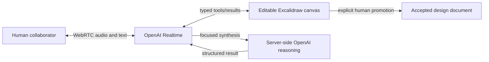

# CoThinker design

## Product model

CoThinker helps a person externalize, inspect, revise, and accept ideas in one shared surface. The essential loop is:

1. The human talks to the Realtime collaborator or works directly on the canvas.
2. The collaborator can propose visible canvas changes through validated tools.
3. The human edits, removes, or keeps the proposal.
4. The human explicitly promotes selected work into the durable design document.

The product remains domain-general: the same workflow can hold a technical architecture, experiment plan, workshop, or physical-system explanation.

## Runtime architecture

- The browser owns the shared canvas, WebRTC session, and local workspace persistence.
- The server owns OpenAI configuration and the API key. The browser has no credential path.
- Realtime receives a shared set of typed tool definitions. Arguments are validated before mutations, invalid calls return structured errors, and a tool never reports success unless the mutation completed.
- Deeper reasoning is an optional server-side tool result, not a local substitute or fabricated fallback. It must not replace the Realtime collaborator’s live exchange.
- AI-originated canvas work remains visibly distinct and removable until the human accepts it. When an operation targets human-owned elements, the original remains untouched and the proposal carries action lineage, replacement IDs, and any remapped bindings. Clearing proposals removes only the AI branch; explicit promotion replaces the linked original with a coherent human-owned result and retains provenance in the serialized scene.

The model-facing canvas tools are intentionally small: element updates cover labels, position, and size; named grouping, deletion, merging, and connection are separate operations; and one layout operation covers alignment, distribution, and grid snapping. Existing connections and bound labels are regenerated or remapped with every transform so proposals do not leave dangling flow.

## Workspace lifecycle

The persisted workspace contains a serialized canvas scene, transcript, accepted sections, activity events, selection, and session status. `cothinker-workspace-v1` is migrated once into the versioned current format; incompatible demo sections are discarded while valid transcripts and accepted work are retained. **New session** clears all workspace artifacts and starts with a blank canvas.

## Deliberately excluded scope

- accounts, remote persistence, or multi-user synchronization;
- deployment or production observability;
- autonomous document acceptance, rewriting, or deletion of human work;
- browser speech-recognition/synthesis and deterministic local collaboration substitutes.

## Remaining manual check

Before a release, run the real-key microphone smoke test in the README using a safe development key. Automated tests mock upstream calls and cannot validate browser permission UX, actual OpenAI audio, or quota-backed interruption behavior.
